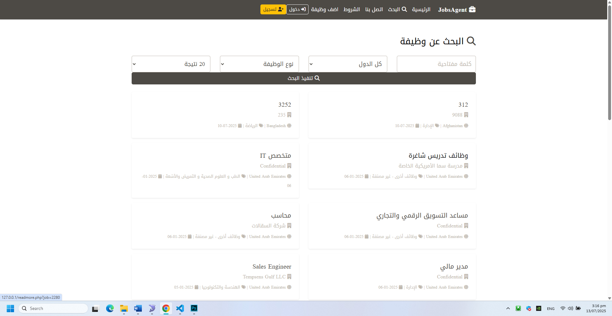

# Jobs Agent

منصة مجانية لتوفير فرص العمل بطريقة ذكية وعملية، تعتمد على تقنيات PHP وBootstrap.

## المميزات

- عرض فرص العمل حسب الفئة أو التخصص
- نظام بحث سريع باستخدام الكلمات المفتاحية
- واجهة متجاوبة للموبايل والكمبيوتر
- تصميم أنيق باستخدام Bootstrap

## التقنيات المستخدمة

- PHP
- Bootstrap
- JavaScript
- MySQL (اختياري)

## كيفية الاستخدام

1. حمّل المشروع
2. ضع الملفات على سيرفر محلي (XAMPP أو WAMP)
3. افتح `index.php` لتبدأ

## المساهمة

مرحبًا بجميع المساهمات! يمكنك فتح "issue" أو إرسال "pull request".

## الرخصة

[MIT License](LICENSE)

## 🔎 صور من المشروع

### 🏠 الواجهة الرئيسية

### 📄 نتائج البحث

### 👤 تفاصيل الوظيفة

